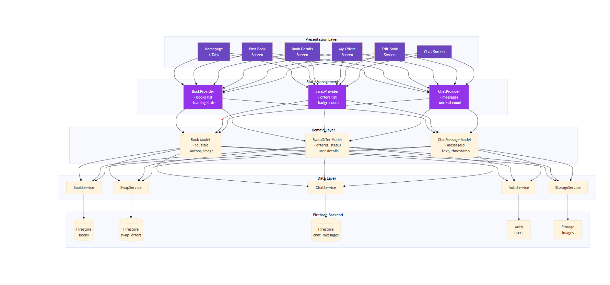

# BookSwap - Flutter Book Exchange Application

## Overview

BookSwap is a mobile application that allows users to list, browse, and exchange books with other users through an intuitive swapping system. Built with Flutter and Firebase, it provides real-time chat, swap offer management, and notification badges.

---

## Features

### Core Features

- **User Authentication**: Email/password authentication with email verification via Firebase Auth
- **Book Management**:
  - Create, Read, Update, Delete (CRUD) operations for book listings
  - Image upload and compression
  - Book condition tracking (New, Like New, Good, Used)
  - Swap preference specification
- **Swap System**:
  - Send and receive swap offers
  - Accept/reject/cancel offers
  - Real-time offer status updates
  - Pending offer notifications with badges
- **Real-time Chat**:
  - Message exchange between users
  - Unread message badges
  - Timestamp tracking
- **Settings & Preferences**:
  - Notification toggle (email/push notifications)
  - Account management
  - Sign out functionality

---

## Architecture

> **Note:** Create a `docs/images/` folder in your project root and add these diagrams:
>
> - `architecture-diagram.png` - Full system architecture
> - `database-erd.png` - Entity relationship diagram
> - `state-management-diagram.png` - State flow visualization

### Project Structure

The app is organized into clear layers, making it easy to maintain and extend:

```
lib/
├── main.dart                    # Starting point - app theme and routing
├── firebase_options.dart        # Firebase configuration
├── models/                      # Data structures
│   ├── book.dart
│   ├── swap_offer.dart
│   └── chat_message.dart
├── providers/                   # Managing app state
│   ├── book_provider.dart
│   ├── swap_provider.dart
│   └── chat_provider.dart
├── screens/                     # What users see
│   ├── homepage.dart
│   ├── login_page.dart
│   ├── sign_up_screen.dart
│   ├── post_book.dart
│   ├── edit_book_screen.dart
│   ├── book_details_screen.dart
│   ├── my_offers_screen.dart
│   └── chat_screen.dart
├── services/                    # Connecting to Firebase
│   ├── auth_service.dart
│   ├── book_service.dart
│   ├── swap_service.dart
│   ├── chat_service.dart
│   └── storage_service.dart
└── utils/                       # Helper functions
    └── image_helper.dart
```

### Architecture Diagram



_The app follows a clean layered architecture: screens talk to providers, providers use services, and services connect to Firebase._

---

## Database Schema

### Firestore Collections


_Entity Relationship Diagram showing how books, swap offers, and chat messages connect._

#### `books` Collection

Each book listing contains:

```dart
{
  id: String,              // Unique identifier
  title: String,           // Book title
  author: String,          // Author name
  condition: String,       // Current condition
  swapFor: String,         // What the owner wants
  ownerId: String,         // Who posted it
  ownerEmail: String,      // Owner's email
  imageUrl: String,        // Book cover image
  createdAt: Timestamp,    // When it was posted
}
```

#### `swap_offers` Collection

Tracking swap requests between users:

```dart
{
  id: String,              // Unique offer ID
  fromUserId: String,      // Person making the offer
  fromUserEmail: String,
  toUserId: String,        // Book owner
  toUserEmail: String,
  offeredBookId: String,   // Book being offered
  offeredBookTitle: String,
  requestedBookId: String, // Book they want
  requestedBookTitle: String,
  status: String,          // pending/accepted/rejected
  createdAt: Timestamp,
}
```

#### `chat_messages` Collection

Storing conversations between users:

```dart
{
  id: String,              // Message ID
  chatId: String,          // Links messages together
  senderId: String,        // Who sent it
  receiverId: String,      // Who receives it
  text: String,            // Message text
  timestamp: Timestamp,    // When sent
  read: Boolean,           // Has it been read?
}
```

---

## State Management

### Provider Pattern


_How data flows through the app - from user actions to UI updates._

The app uses **Provider** for managing state. It's simple and works well for this project size:

**Why Provider?**

- Easy to learn and understand
- Only rebuilds what needs updating
- Perfect for small to medium apps

**How it works:**

```dart
// 1. Creating a provider to hold state
class BookProvider extends ChangeNotifier {
  List<Book> _books = [];
  bool _loading = false;

  List<Book> get books => _books;
  bool get loading => _loading;

  Future<void> fetchBooks() async {
    _loading = true;
    notifyListeners(); // Tells widgets to rebuild

    _books = await bookService.getBooks();

    _loading = false;
    notifyListeners(); // Updates UI with new books
  }
}

// 2. Making providers available everywhere
MultiProvider(
  providers: [
    ChangeNotifierProvider(create: (_) => BookProvider()),
    ChangeNotifierProvider(create: (_) => SwapProvider()),
    ChangeNotifierProvider(create: (_) => ChatProvider()),
  ],
  child: MyApp(),
)

// 3. Using providers in screens
final bookProvider = context.read<BookProvider>();
await bookProvider.fetchBooks(); // Calling methods

final books = context.watch<BookProvider>().books; // Getting data
```

---

## Getting Started

### Prerequisites

- **Flutter SDK**: Version 3.9.2 or higher
- **Dart SDK**: Version 3.0.0 or higher
- **Android Studio / VS Code**: With Flutter & Dart plugins
- **Firebase Account**: For backend services
- **Git**: For version control

### Installation Steps

#### 1. Clone the Repository

```bash
git clone <repository-url>
cd individual_assignment_2
```

#### 2. Install Dependencies

```bash
flutter pub get
```

#### 3. Firebase Setup

##### a) Creating your Firebase project

1. Go to [Firebase Console](https://console.firebase.google.com/)
2. Click "Create a project" and name it "BookSwap"
3. Follow the prompts (Google Analytics is optional)

##### b) Adding Android app

1. Click "Add app" and choose Android
2. Enter package name: `com.example.individual_assignment_2`
3. Download `google-services.json`
4. Put it in: `android/app/google-services.json`

##### c) Adding iOS app (optional)

1. Click "Add app" and choose iOS
2. Enter bundle ID: `com.example.individualAssignment2`
3. Download `GoogleService-Info.plist`
4. Put it in: `ios/Runner/GoogleService-Info.plist`

##### d) Enabling authentication

1. Go to Authentication → Sign-in method
2. Turn on Email/Password

##### e) Setting up Firestore

1. Go to Firestore Database
2. Click "Create database"
3. Choose "Start in test mode"
4. Pick your region

##### f) Creating database indexes

The app needs these indexes to work properly:

```
books: ownerId + createdAt
swap_offers: fromUserId + createdAt
swap_offers: toUserId + createdAt
chat_messages: chatId + timestamp
chat_messages: receiverId + read
```

Creating them:

1. Open Firestore → Indexes
2. Click "Create Index"
3. Add the collection and fields listed above
4. Save each one

##### g) Setting up Storage

1. Go to Storage
2. Click "Get started"
3. Use test mode for now

##### h) Using FlutterFire CLI (easiest way)

```bash
dart pub global activate flutterfire_cli
flutterfire configure
```

This automatically sets everything up for you!

#### 4. Update Firebase Security Rules

**Firestore Rules** (for production):

```javascript
rules_version = '2';
service cloud.firestore {
  match /databases/{database}/documents {
    // Books collection
    match /books/{bookId} {
      allow read: if request.auth != null;
      allow create: if request.auth != null
                    && request.resource.data.ownerId == request.auth.uid;
      allow update, delete: if request.auth != null
                            && resource.data.ownerId == request.auth.uid;
    }

    // Swap offers collection
    match /swap_offers/{offerId} {
      allow read: if request.auth != null;
      allow create: if request.auth != null
                    && request.resource.data.fromUserId == request.auth.uid;
      allow update: if request.auth != null
                    && (resource.data.fromUserId == request.auth.uid
                        || resource.data.toUserId == request.auth.uid);
    }

    // Chat messages collection
    match /chat_messages/{messageId} {
      allow read, write: if request.auth != null
                         && (resource.data.senderId == request.auth.uid
                             || resource.data.receiverId == request.auth.uid);
    }
  }
}
```

#### 5. Run the App

##### On Android Emulator

```bash
flutter run
```

##### On Physical Device

1. Enable **Developer Options** and **USB Debugging** on your Android device
2. Connect via USB
3. Run: `flutter run`

##### Build APK

```bash
flutter build apk --release
```

APK location: `build/app/outputs/flutter-apk/app-release.apk`

---

## Dependencies

```yaml
dependencies:
  flutter:
    sdk: flutter

  # Firebase
  firebase_core: ^2.24.2
  firebase_auth: ^4.16.0
  cloud_firestore: ^4.14.0
  firebase_storage: ^11.6.0

  # State Management
  provider: ^6.1.1

  # Utilities
  shared_preferences: ^2.2.2
  image_picker: ^1.0.7
  image: ^4.1.6
```

---

## Key Features Implementation

### Email Verification Flow

When users sign up, they need to verify their email before accessing the app:

```dart
// Creating account
await FirebaseAuth.instance.createUserWithEmailAndPassword(...)

// Sending verification email
await user.sendEmailVerification()

// Checking verification status
if (!user.emailVerified) {
  // Showing verification prompt
}
```

### Real-time Chat System

Messages appear instantly using Firestore's live updates:

```dart
FirebaseFirestore.instance
  .collection('chat_messages')
  .where('chatId', isEqualTo: chatId)
  .orderBy('timestamp')
  .snapshots()
  .listen((snapshot) {
    // Updating UI with new messages
  });
```

### Notification Badges

Keeping track of what's new:

- **Unread messages** - Counting messages where `read == false`
- **Pending offers** - Counting offers where `status == 'pending'`
- Both update automatically through Provider

---

## Design Decisions & Trade-offs

### 1. Storing images as Base64

**Why:** Simpler to implement - everything stays in one place

**Benefits:**

- No juggling between Firestore and Storage
- Image and book data update together

**Drawbacks:**

- Makes documents larger
- Uses more data

**Why this choice:** For a learning project, keeping things simple matters more than perfect efficiency.

### 2. Using Provider for state

**Why:** It's beginner-friendly and does the job well

**Benefits:**

- Easy to understand
- Less setup code
- Great documentation

**Drawbacks:**

- Not as advanced as newer options
- Can get messy in huge apps

**Why this choice:** Perfect balance of simplicity and power for this app size.

### 3. Real-time chat updates

**Why:** Messages appear instantly without refreshing

**Benefits:**

- Feels responsive and modern
- Updates happen automatically

**Drawbacks:**

- Costs more on Firebase
- Needs constant connection

**Why this choice:** Better user experience is worth it for a small app.

### 4. Combining user IDs for chats

**Why:** Creating unique chat rooms for two people

**Benefits:**

- No duplicate conversations
- Easy to find existing chats

**Drawbacks:**

- Would need rethinking for group chats

**Why this choice:** Keeps one-on-one chats simple without overcomplicating things.

---

## Testing

### Run Unit Tests

```bash
flutter test
```

### Run Widget Tests

```bash
flutter test test/widget_test.dart
```

---

## Known Issues

1. **Analyzer warnings** - Two info-level warnings about using `BuildContext` after async operations. These are common in Flutter apps and don't break anything.

2. **Email verification** - Users could technically bypass the email check by refreshing. In production, you'd want server-side verification.

3. **Image loading** - Large images might take a moment to process. Could add loading indicators for better feedback.

---

## Future Enhancements

- [ ] Search and filter books by title/author/condition
- [ ] User profiles with ratings and reviews
- [ ] Push notifications via Firebase Cloud Messaging
- [ ] Image caching for better performance
- [ ] Group chat functionality
- [ ] Wishlist and favorite books
- [ ] Swap history and analytics

---

## Author

**Student**: [Your Name]  
**Course**: [Course Code - Course Name]  
**University**: [University Name]  
**Semester**: [Semester/Year]

---

## Contact

For questions or issues, please contact: [your.email@university.edu]

---

## Acknowledgments

- Flutter team for excellent documentation
- Firebase for backend infrastructure
- Provider package maintainers
- Stack Overflow community for troubleshooting help
